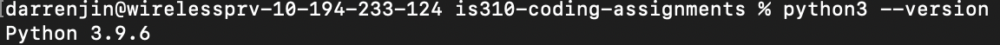
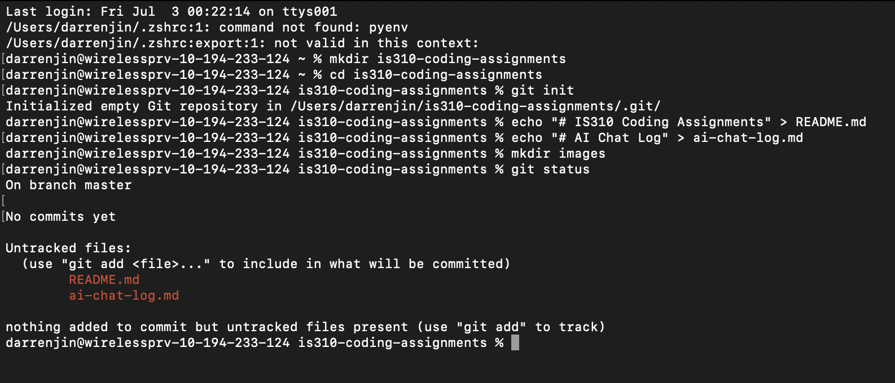
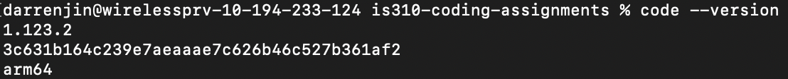

# Init IS310 Homework

## Proof of Installation

1. Python

2. Git

3. VS Code

4. Hypothesis Username
hongjuj2

5. AI Tool/Workflow
I plan to use claude AI installed in VS code to create the required folders, check installed tool versions. Usage log of AI will be written in ai-chat-log.md
